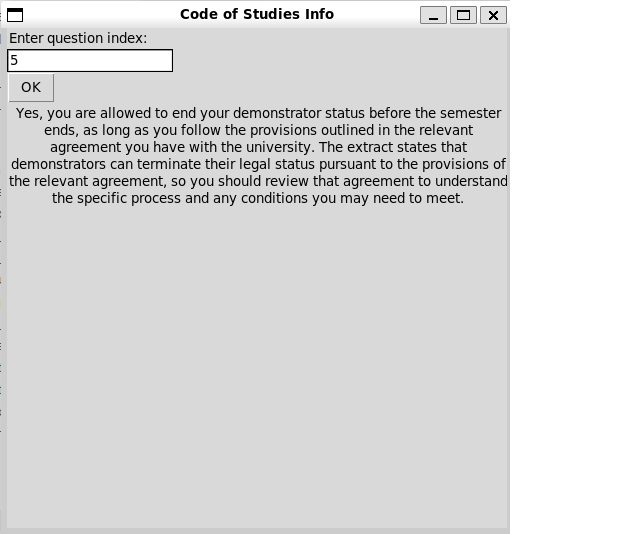

# Code of Studies Info

This is an Artificial Intelligence-based question answering system, based on Retrieval Augmented Generation (RAG). 

_Note that this is an assigment for University, and I am still working on it ! :)_

## How it works

The system takes an input question, and uses the Code of Studies to create a prompt for the Large Language Model (LLM). The documentum will be divided into smaller parts, and then the most relevant parts will be sent to the LLM, so it can answer the question using the given text as extra knowledge. Calculating the most relevant parts of the documentum is also an operation that uses AI.

## The steps

### Preprocessing

We have to preprocess the student questions as well as the document (Code of Studies).

- **questions:** We perform embedding, which means that each question is transformed into a vector of 768 dimensions.
- **document:** The document's text will be divided into smaller parts. You can choose what is meant by a small part. You can also combine them, while assembling the prompt in the future. I work with two text units: _chunks_ and _sentences_, but you can add your own implementation as well. All you have to do is creating your own method that cuts the document into pieces. After creating the text units, we perform the embedding on them too.

### Pipeline

The elements of the question pipeline are the following:

1. **Calculate similarities:** Cosine similarity will be calculated between the _question vector_ and each of the _text unit vectors_.
2. **Calculate _top x_ text units with embedding:** The indexes of the text units that are most similar to the question according to the cosine similarity will be calculated.
3. **Calculate _top y_ text units with reranking:** Now using the _top x_ indexes, we will calculate text units that are most likely to answer the question. 

If necessary, pipeline elements can be run separately.

### Prompt generation

Two texts will be generated for each question:

1. **System content:** Gives the model the question and instruct it to answer it using the relevant text.
2. **User content:** The relevant text.

These texts will be inserted in the prompt as appropriate and sent to the LLM. The student will receive the answer to her/his question. (Hopefully!)

## How to run the script

0. Make sure you have _python3_ installed. You can check it by running the following command:

    ~~~
    python3 --version
    ~~~

    You will also need an _OpenAI API key_. Create a _.env_ file, and save it there: 

    ~~~
    OPENAI_API_KEY="your-open-api-key"
    ~~~

1. Save your questions in _data/questions/questions.txt_. Each question should be in a separate line. These questions will be identified by their indexes, thus, on which line of the file they are located. (Starting with zero!)
2. Customize script.py, then run it. 

    ~~~
    python3 script.py
    ~~~

    _Note: You must run this command from the directory where the file is located._

3. The aswer for the _{i}._ question will be saved in _data/responses/q{i}.txt_, where _i_ is the index of the question in the _questions.txt_ file.

## How to use the GUI

The GUI is quite simple. Here is how to use it:

0. Make sure you have _python3_ installed. You can check it by running the following command:

    ~~~
    python3 --version
    ~~~

    You will also need an _OpenAI API key_. Create a _.env_ file, and save it there: 

    ~~~
    OPENAI_API_KEY="your-open-api-key"
    ~~~

1. Save your questions in _data/questions/questions.txt_. Each question should be in a separate line. These questions will be identified by their indexes, thus, on which line of the file they are located. (Starting with zero!)

2. Run _info.py_ with the following command:

    ~~~
    python3 info.py
    ~~~
3. In the pop-up window you can enter the index of your question. Click the _OK_ button, and the answer will be displayed.

    

## Future plans
 - **Documentation**... ✓
 - Writing about the **question database** ✓
 - Analyse the **answers** according to different criteria
 - Some **data visualization** using _Matplotlib_
 - Playing with the **parameters** (_top x_, _top y_)
 - Different ways of choosing the relevant **text slices** (For example: Using chunks that contain the chosen sentences)
 - A simple **GUI** may be nice ✓
 - **Refactor** the code a bit more
 - Make it possible to **directly ask** questions