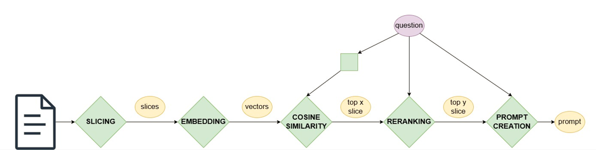

### Code Structure

For creating the prompt, the following steps were implemented:

The code is structured according to these steps.

**preprocess_document**: Slicing the document (into chunks and sentences), and perform embedding on the slices. The embedding will result in 768 dimensional vectors.

**preprocess_question**: Embedding the questions, this will also result in 768 dimensional vectors.

**question_pipeline**: First, we calculate the similarities between the slices and the question. Then, we choose the _top x_ most similar slices to the question for reranking. After reranking, we select the _top y_ slices that are most likely to contain the answer to the question. We perform this on each question.

**api**: We create the prompt text for each question, containing the question itself and the relevant slices. Now we can send the prompt for any question we want.